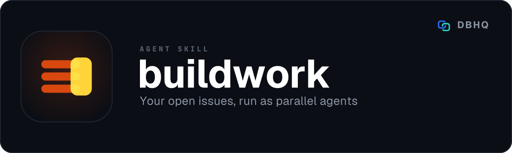

<div align="center">



# buildwork

**Your open issues, run as parallel agents - one per issue, one pull request each**

[](LICENSE)
[](https://code.claude.com/docs/en/plugins)
[]()

A free, open-source tool by [DBHQ](https://dbhq.uk) - documented at [skills.dbhq.uk](https://skills.dbhq.uk/buildwork/)

</div>

---

Run a repository's open issues as parallel agents - one per issue, each in its own worktree, each opening its own pull request - then check the results and propose a merge order.

An agent skill for [Claude Code](https://code.claude.com) and [Codex](https://developers.openai.com/codex/cli). Install it, tell it what you are trying to get done today, and it works out what can safely run at once.

```
Goal: get the deploy pipeline unblocked
Runner: paseo, up to 4 at once, cut from origin/main. Order from roadmap.md.

Wave 1 (2 in parallel):
  #143  The GitHub metadata register has drifted  (by @maintainer, owner)  [hotspot: .github/workflows/deploy.yml]
      buildwork/issue-143-the-github-metadata-register
  #147  Stale reference in the hosting doc  (by @maintainer, owner)
      buildwork/issue-147-stale-reference-in-the-hosting

Wave 2 (alone):
  #144  Positioning changed on the landing copy  (by @someone, none)
      buildwork/issue-144-positioning-changed-on-the

! #144 was opened by @someone, who is not an owner, member or collaborator here (GitHub says NONE). Its body goes into a worker's brief word for word: read it before you approve.
! #151 waits a wave: it touches .github/workflows/deploy.yml, already claimed in this wave.
~ Dependency links were read from GitHub, through gh's `blockedBy` field.
```

## What makes it different

Several tools already run coding agents in parallel over git worktrees. They isolate the agents and then leave task alignment, conflict resolution and merge decisions to you. They are session managers.

Worktrees solve exactly one problem: two agents writing the same file at the same time. They do nothing about **the file every branch has to touch** - the route registry, the response headers, the lockfile, the content plan. Isolation just defers the pile-up to merge time.

buildwork's job is the layer above isolation:

- **It refuses.** One issue, or several issues that are really one piece of work, gets a `DO NOT FAN OUT` and a reason. A single agent matches or beats a multi-agent system on most tasks, at roughly a fifteenth of the tokens. The commonest mistake this tool can prevent is using it.
- **It serialises collisions.** Two issues that claim the same file never share a wave. Before you merge, it finds the collisions nobody declared, from the real diffs.
- **It checks before it hands anything over.** Scope, hotspots and your own test suite, then an honest statement that mechanical checks are a floor and not a verdict.
- **It never merges.** It proposes an order and gives its reasons. There is no merge verb in the codebase.

## Install

### As a Claude Code plugin (recommended)

```
/plugin marketplace add dbhq-uk/marketplace
/plugin install buildwork@dbhq
```

### Any agent (Cursor, Copilot, Windsurf, Gemini, Cline and more)

```bash
npx skills add dbhq-uk/buildwork-skill
```

The [skills.sh](https://skills.sh) CLI installs into whichever agent directories
it finds, so this works outside Claude Code and Codex too.

### Local install (Claude Code or Codex)

```bash
git clone https://github.com/dbhq-uk/buildwork-skill.git
cd buildwork-skill
./install.sh          # Claude Code: symlinks into ~/.claude/skills (edits are live)
./install-codex.sh    # Codex: installs into ~/.codex/skills
```

[`install.sh`](install.sh) and [`install-codex.sh`](install-codex.sh) are the
same install two ways: Claude Code substitutes `${CLAUDE_SKILL_DIR}`, so the
whole skill directory is symlinked untouched, while Codex does not, so its
`SKILL.md` is rewritten at install time. Re-run the Codex one after editing
`SKILL.md`.

## Requirements

Python 3.11 or later, standard library only. `git` 2.38 or later, for the
trial merges in `order`, and `gh` authenticated - the whole skill is pull
requests and issues. When `gh` fails, every command stops with
gh's own error rather than reading the failure as an empty repository, and
`doctor` checks the login and which repository `gh` resolves this clone to.

Plus a runner: Paseo, or a host whose subagent tool can create a git
worktree. Neither is installed by this skill.

## Opt in, per repository

buildwork does nothing at all until a repository has a `.github/buildwork.toml` saying `enabled = true`. Write a starter:

```bash
python3 ~/.claude/skills/buildwork/scripts/buildwork.py init
```

It suggests hotspots from the files most often touched in recent merges, and writes `enabled = false`. Arming it is your edit, deliberately.

Full field reference: [`references/config.md`](skills/buildwork/references/config.md).

## How a session goes

1. **It asks what you are trying to get done.** Every time. The agent turns your answer into a list of issues and shows it to you before planning, which is what stops you paying for five agents doing work you did not want today. With no roadmap and no list, `plan` refuses rather than take every open issue.
2. **It plans**, and shows you the waves, the collisions and the assumptions, and who opened each issue. An issue from outside the repository gets a warning, because its body becomes an agent's instructions. Nothing is created until you approve.
3. **It dispatches** wave one - a Paseo tab or a host subagent per issue, each with a self-contained brief and a shared digest of your conventions read once rather than five times.
4. **It goes idle.** No polling. The notification arrives on its own when a worker finishes, errors or needs permission. A permission request goes to you, not to the orchestrator. An optional one-off watchdog catches an agent that dies without a word, and a stalled branch gets one re-dispatch onto the same branch.
5. **It collects** - scope, hotspots, your test suite - and offers exactly one rework per failure before handing it to you.
6. **It proposes a merge order**, with a line of reasoning per position, and checks it with trial merges that merge nothing: each branch against the base, each pair, and the order played through. A conflict goes back to the worker that owns the branch, to rebase it. You merge.

## Runners

| | paseo | subagent |
|---|---|---|
| Survives your session | yes | no |
| You can watch and intervene | yes | while your session lasts: message, stop, list |
| Concurrent cap | 4 | 2 |
| Resume after a crash | yes | yes |

Resume works on both because it is reconstructed from git branches, pull requests and worktrees - never from a cached map of agent ids. `status` is correct from a cold start with no session record at all.

[`references/runners.md`](skills/buildwork/references/runners.md) has the exact calls, and why detached CLI workers were rejected.

## What it does not do

- **It does not merge.** No `gh pr merge`, no push to base.
- **It does not close issues.** A worker's pull request carries `Closes #N`; GitHub closes it when a human merges.
- **It does not catch semantic conflict.** Agent A writes a helper, agent B changes its signature, neither branch is broken alone and the merge is. That is caught by your test suite or by you. Mechanical QC is a floor, and the tool says so rather than implying otherwise.
- **It does not draw a dashboard.** Paseo is better at that.
- **It does not run on a schedule.** Every pass is on demand.

## The pair

`buildwork` runs the work. [`deskwork`](https://github.com/dbhq-uk/deskwork-skill) decides what the work is and what order it goes in - it files issues, reasons about precedence, writes dependency edges back to GitHub, and renders `roadmap.md`.

Neither needs the other. buildwork reads issues and a roadmap file whoever wrote them, and falls back to open issues in no particular order while saying so.

## Also from DBHQ

Every DBHQ agent skill is free, open source and installable from the same
marketplace, and all of them are documented at
**[skills.dbhq.uk](https://skills.dbhq.uk)**. The marketplace itself is
[dbhq-uk/marketplace](https://github.com/dbhq-uk/marketplace) - one
`/plugin marketplace add` and every one of them is available.

| Skill | What it does |
|---|---|
| [outlook](https://skills.dbhq.uk/outlook/) | Microsoft 365 mail and calendar, from the terminal |
| [trello](https://skills.dbhq.uk/trello/) | Your boards, run from your agent |
| [legwork](https://skills.dbhq.uk/legwork/) | Research that settles a decision, and says when it cannot |
| [dovetail](https://skills.dbhq.uk/dovetail/) | Checks whether your repository still agrees with itself |
| [verve](https://skills.dbhq.uk/verve/) | Strips AI tells from prose and puts a voice back |
| [vela](https://skills.dbhq.uk/vela/) | Compiler-exact code search, in any language you index |
| [garmin](https://skills.dbhq.uk/garmin/) | Your Garmin data, answered in the terminal |
| [imager](https://skills.dbhq.uk/imager/) | Images from GPT Image 2, costed before it spends |
| [gitview](https://skills.dbhq.uk/gitview/) | Which branches are finished, and safe to delete |
| [atlassian](https://skills.dbhq.uk/atlassian/) | Jira issues and Confluence pages |
| [pennyblack](https://skills.dbhq.uk/pennyblack/) | A physical letter, posted from the terminal |
| [deskwork](https://skills.dbhq.uk/deskwork/) | What an agent noticed, tracked as real work |
| [groupwork](https://skills.dbhq.uk/groupwork/) | A second agent on the work, adversary or partner |
| [headwork](https://skills.dbhq.uk/headwork/) | One decision at a time, with a recommendation |

Plus [heliograph](https://skills.dbhq.uk/heliograph/), for a machine you cannot log into.

## Licence

MIT. See [LICENSE](LICENSE).
